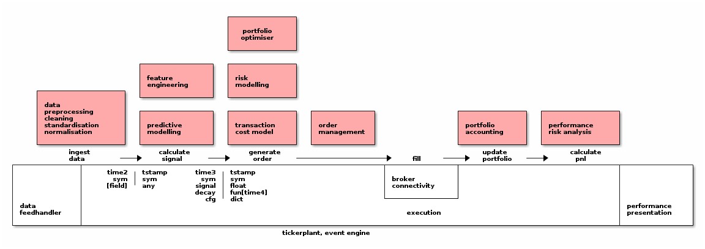

# Table of Contents

1.  [Description](#orga20baeb)
2.  [Interfaces](#org47c100d)

# Description

<table border="2" cellspacing="0" cellpadding="6" rules="groups" frame="hsides">

<colgroup>
<col  class="org-left" />

<col  class="org-left" />
</colgroup>
<thead>
<tr>
<th scope="col" class="org-left">Module/plugin/component/process</th>
<th scope="col" class="org-left">Responsibilities and I/O interface</th>
</tr>

<tr>
<th scope="col" class="org-left">(depending on architecture )</th>
<th scope="col" class="org-left">&#xa0;</th>
</tr>
</thead>

<tbody>
<tr>
<td class="org-left">Data feedhandler</td>
<td class="org-left">Ingestion of external data sources, conversion of formats and protocols. (e.g. exchanges or public sources such as quandl)</td>
</tr>

<tr>
<td class="org-left">&#xa0;</td>
<td class="org-left">Feedhandler will capture and convert streams from an external source into a format suitable for further processing.</td>
</tr>
</tbody>

<tbody>
<tr>
<td class="org-left">Data preprocessing, standardisation</td>
<td class="org-left">Treatment of outliers, missing data and cross­checking/validation of raw input, making it more robust.</td>
</tr>

<tr>
<td class="org-left">normalisation and cleaning</td>
<td class="org-left">Includes data standardisation through techniques such as percentile ranking, z­scoring etc.</td>
</tr>
</tbody>

<tbody>
<tr>
<td class="org-left">Feature engineering</td>
<td class="org-left">Conversion of raw input data into alpha signals. Typical strategy then consists of one or several alphas, risk and transaction cost modelling.</td>
</tr>

<tr>
<td class="org-left">(alpha generation)</td>
<td class="org-left">The search for the optimal parameters of the alpha model.</td>
</tr>
</tbody>

<tbody>
<tr>
<td class="org-left">Predictive modelling</td>
<td class="org-left">Signal combination, boosting, normalisation and processing.</td>
</tr>

<tr>
<td class="org-left">&#xa0;</td>
<td class="org-left">Reconciliation of conflicting or reinforcing signals of different strength, accuracy and rate of decay into single consolidated signal per instrument.</td>
</tr>

<tr>
<td class="org-left">&#xa0;</td>
<td class="org-left">e.g. regression (supervised learning), classification trees (unsupervised learning).</td>
</tr>

<tr>
<td class="org-left">&#xa0;</td>
<td class="org-left">You can have multiple (possibly correlated) predictors for an instrument. How to combine them, linearly or non-linearly, so that you get a single recommendation per instrument?</td>
</tr>

<tr>
<td class="org-left">&#xa0;</td>
<td class="org-left">Regression is one example (supervised learning). Classification trees is another one (unsupervised learning).</td>
</tr>

<tr>
<td class="org-left">&#xa0;</td>
<td class="org-left">Percentile ranking, Z-scoring is just a way of normalising or standardising data/signals, making it more robust and does not belong here.</td>
</tr>

<tr>
<td class="org-left">&#xa0;</td>
<td class="org-left">If you linearly combine signals (that were or were not standardised into percentile ranks), this is a form of regression.</td>
</tr>

<tr>
<td class="org-left">&#xa0;</td>
<td class="org-left">Garbage in garbage out (GIGO) principle holds here - the real value is the predictors that you input into the algo. There is no way of squeezing alpha if all your predictors have zero value.</td>
</tr>

<tr>
<td class="org-left">&#xa0;</td>
<td class="org-left">Similarly, if you have one valuable predictor and the rest is garbage, the best you can do with any machine learning algorithm is the alpha of that standalone predictor.</td>
</tr>
</tbody>

<tbody>
<tr>
<td class="org-left">Risk</td>
<td class="org-left">Predictive risk modelling, ex-­ante attribution, monitoring and controlling (budgeting, hedging or neutralisation) as input to portfolio construction, optimisation and ultimately order sizing.</td>
</tr>

<tr>
<td class="org-left">&#xa0;</td>
<td class="org-left">Concerns sources of risk external to the strategy: market/sector/credit, factor, liquidity and other. Excludes, for example, signal dispersion.</td>
</tr>
</tbody>

<tbody>
<tr>
<td class="org-left">Transaction cost model</td>
<td class="org-left">Market impact modelling, typically as a function of order size, among other factors.</td>
</tr>
</tbody>

<tbody>
<tr>
<td class="org-left">Portfolio Optimiser</td>
<td class="org-left">Inputs are (anonymised) alpha signals, risk parameters and constraints and transaction cost functions. Output is sized order.</td>
</tr>

<tr>
<td class="org-left">&#xa0;</td>
<td class="org-left">This is any mathematical algorithm that, given constraints (e.g. sector constraint) and predicted returns, risk and liquidity,</td>
</tr>

<tr>
<td class="org-left">&#xa0;</td>
<td class="org-left">will calculate target weights for each asset in the universe that maximise overall portfolio risk-return objectives.</td>
</tr>

<tr>
<td class="org-left">&#xa0;</td>
<td class="org-left">e.g. Markowitz mean-­variance optimisation, linear programming, quadratic programming or as simple as equal­-weighted schemes.</td>
</tr>

<tr>
<td class="org-left">&#xa0;</td>
<td class="org-left">This is pure mathematical problem, when properly isolated.</td>
</tr>

<tr>
<td class="org-left">&#xa0;</td>
<td class="org-left">Similar to the GIGO argument above, I would argue that the portfolio optimisation does not produce additional alpha if properly isolated.</td>
</tr>

<tr>
<td class="org-left">&#xa0;</td>
<td class="org-left">This is not to be confused with asset allocation, which is actually alpha generation plugin.</td>
</tr>
</tbody>

<tbody>
<tr>
<td class="org-left">Event engine / tickerplant</td>
<td class="org-left">passing market data, signal, order, fill, trade events between components and services. Responsible for guaranteed, timely delivery</td>
</tr>
</tbody>

<tbody>
<tr>
<td class="org-left">Order management</td>
<td class="org-left">Managing the lifecycle of order, from generation at the optimiser, splitting, routing, adjusting, cancelling to filling and allocation of fills to accounts</td>
</tr>
</tbody>

<tbody>
<tr>
<td class="org-left">Execution</td>
<td class="org-left">Process converting order event into fill event. Simulation in case of backtesting</td>
</tr>
</tbody>

<tbody>
<tr>
<td class="org-left">Broker connectivity</td>
<td class="org-left">order execution, account import/export via broker API</td>
</tr>
</tbody>

<tbody>
<tr>
<td class="org-left">Portfolio accounting</td>
<td class="org-left">Tracking realised and unrealised P&L, FIFO/LIFO/Avg Cost Pooled accounting, inventory. Basically a dictionary of sub-accounts, one sub-account for each trade.</td>
</tr>

<tr>
<td class="org-left">&#xa0;</td>
<td class="org-left">It is important to define trade as a set of allocated fills that move the position in instrument from zero to non-zero position and back to zero.</td>
</tr>

<tr>
<td class="org-left">&#xa0;</td>
<td class="org-left">Each fill triggers an allocation entry into the specific trade sub-account (which one is determined by algo or inventory accounting principles- FIFO, LIFO, average price) and inventory cost is maintained.</td>
</tr>

<tr>
<td class="org-left">&#xa0;</td>
<td class="org-left">Realized P&L is booked into cash account as soon as crossing fill arrives. Unrealized P&L is calculated from asof join of trades with quotes (mark to market).</td>
</tr>
</tbody>

<tbody>
<tr>
<td class="org-left">Performance & risk analysis</td>
<td class="org-left">Ex-­post return and risk measurement of strategy, contribution and attribution. Sharpe, Sortino, Drawdown, time/ returns etc &#x2026;</td>
</tr>
</tbody>

<tbody>
<tr>
<td class="org-left">Performance presentation</td>
<td class="org-left">Visualisation of results, tables and dashboards, charting</td>
</tr>
</tbody>
</table>

# Interfaces

    `ti2`sym`bid`ask!(.z.p;`AAPL.O;308.6 308.59 308.58;308.61 308.62 308.63)
    `ti3`sym`sig`dcy!(.z.p+200;`AAPL.O;-.54;{exp neg x})
